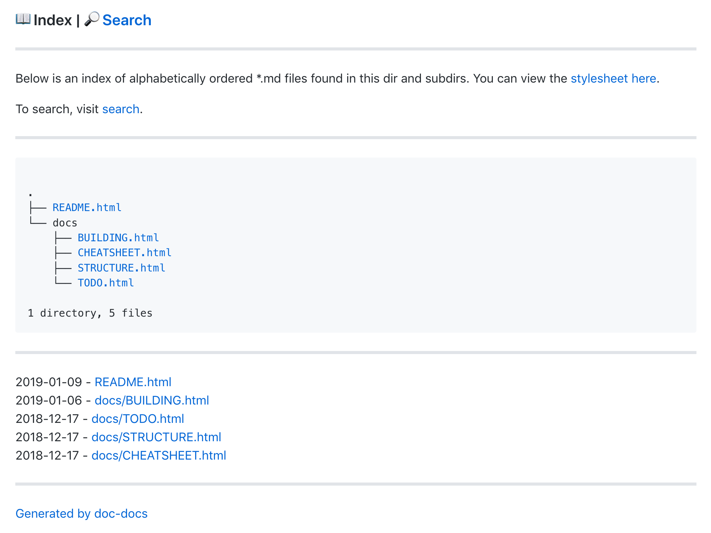

# :whale: doc-docs

Generate, index and make searchable static html files from markdown. "Batteries" included.

## What?

You have some markdown files in the `gfm` format and want to convert them to static html files 
that look like Github's README files.

Screenshot of the generated `index.html` :point_down:


This repo will give you everything you need to spin up a wiki or blog - pandoc, the stylesheet, 
the script to convert. The goal is to keep it simple, so you can edit the source code in a few 
places to get a setup that works the way you want it to. It's basically all shell code (:scream:),
the infra setup needed is minimal and config files are included.

## Why?

- You want to view docs locally in your browser or spin up an Nginx container
- You don't want to make API calls to Github or host your docs there
- You want emojis and stuff without the overhead :rocket:
- You want to index and maybe search your docs

# Quickstart

Clone this repository, build pandoc and run php and nginx:

```
git clone https://github.com/jbauers/doc-docs.git
cd doc-docs
IN_DIR="/path/to/files" ./run.sh
```

## Usage

Run `IN_DIR="/path/to/files" ./run.sh` in the `doc-docs` root.

Change `/path/to/files` to whatever dir you want to index. doc-docs will find and convert all 
mardown files and create `static_files` in the `docs-docs` root. `static_files` will be recreated 
each time you run `./run.sh`. If no `IN_DIR` is defined, doc-docs will generate its own documenation.

# Requirements

- [Docker](https://docs.docker.com/install/)
- To enable search, [docker-compose](https://docs.docker.com/compose/install/)

# Motivation

I feel most "wikis" are overblown. I want something really simple that looks pretty enough, indexes 
my files and makes them searchable, nothing more. If I want authentication, I can do that with 
`nginx` and LDAP. I don't need to edit my files in the browser and I don't want the overhead to 
enable this. I just want to view and search stuff, and it should be fast.

# Notes

Building pandoc may take a while. Only the `gfm` part is needed, so this 
image could (should) probably be made a lot smaller (currently ~231MB). It outputs static html 
files, so worst case you can run this image and delete it afterwards. Except for the `static_files` 
folder, this leaves nothing else on your system. Docker layers make sure that 
when changing `config/*` files, just those will be rebuilt, making only the first build slow.

This will get you up and running and launch doc-docs with search enabled. Edit the scripts and 
files (`doc-docs.sh`, `config/*`) to suit your needs. They are small, it should be simple to 
modify them to make your docs look like you want them to.

